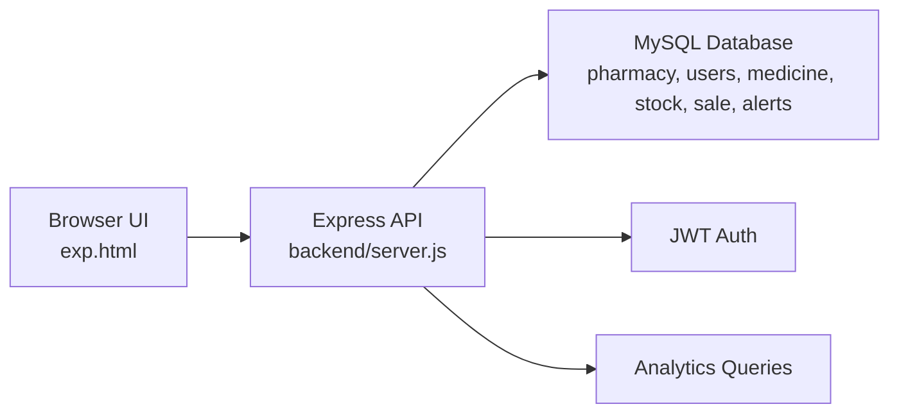

# Mednifi

Mednifi is a pharmacy operations platform built to help pharmacies manage inventory at the batch level, track expiry dates, monitor low-stock risks, record sales, and view account-specific analytics from a single dashboard.

It combines a polished frontend, an Express API, and a MySQL database into a single full-stack project focused on operational safety and day-to-day pharmacy workflow.

Website Link - https://mednifi.onrender.com

## Highlights

- Batch-level medicine inventory management
- Expiry and low-stock alerting
- Sales recording tied directly to inventory batches
- Multi-pharmacy account separation
- Login-protected dashboard, inventory, sales, and suppliers views
- Weekly analytics with live charts
- MySQL-backed persistence with automatic database bootstrap

## Tech Stack

- Frontend: `HTML`, `CSS`, `JavaScript`, `ApexCharts`
- Backend: `Node.js`, `Express`
- Database: `MySQL`
- Auth: `JWT`, `bcryptjs`
- DB driver: `mysql2/promise`
- Config: `dotenv`

## Architecture



## Core Features

### Authentication

- pharmacy owner registration
- secure login with JWT
- password hashing with bcrypt
- private section gating for logged-out users

### Inventory Management

- add medicine batches
- track quantity, batch number, expiry date, and price per unit
- search inventory by medicine or batch
- delete stock batches

### Sales Workflow

- sell from a selected stock batch
- reduce inventory automatically
- create sales records in the database
- update analytics and alerts after each sale

### Alerts

- expiry alerts for stock expiring within 30 days
- low-stock alerts for stock below threshold
- notification bell + dashboard alert panel

### Analytics

- weekly revenue chart
- estimated profit chart
- stock metrics
- expiring and low-stock counts
- top SKU indicator

## How It Works

### Frontend

The live frontend is served from:

- [exp.html](D:/akul/proj/mednifi/exp.html)

This file contains:

- page markup
- component styling
- client-side auth handling
- API fetch calls
- chart rendering logic

### Backend

The backend lives in:

- [backend/server.js](D:/akul/proj/mednifi/backend/server.js)

It is responsible for:

- serving the frontend
- handling auth routes
- validating JWT-protected requests
- performing inventory mutations
- recording sales
- building analytics responses
- refreshing alert data

### Database

The project uses MySQL with schema support in:

- [backend/schema.sql](D:/akul/proj/mednifi/backend/schema.sql)
- [backend/db.js](D:/akul/proj/mednifi/backend/db.js)

The database layer:

- creates the database automatically if needed
- creates required tables
- seeds initial demo data on first run
- exposes a pooled query interface to the backend

## Database Model

Main tables:

- `pharmacy`
- `users`
- `medicine`
- `stock`
- `sale`
- `expiry_alert`
- `stock_alert`
- `suppliers`

Key design idea:

- `medicine` stores the logical medicine entry
- `stock` stores actual physical batches

This allows multiple batches of the same medicine to exist with different:

- expiry dates
- quantities
- prices

## API Overview

### Public

- `GET /`
- `GET /api/health`
- `POST /api/register`
- `POST /api/login`

### Protected

- `POST /api/medicines`
- `GET /api/medicines`
- `POST /api/medicines/sell`
- `DELETE /api/medicines/:stockId`
- `GET /api/analytics`

## Local Setup

### 1. Install dependencies

From [backend](D:/akul/proj/mednifi/backend):

```powershell
npm install
```

### 2. Configure environment

Create `backend/.env`:

```env
DB_HOST=localhost
DB_USER=root
DB_PASSWORD=your_password
DB_NAME=mednifi
PORT=5000
JWT_SECRET=change_this_secret
```

### 3. Start MySQL

Make sure your local MySQL server is running.

### 4. Start the app

```powershell
npm start
```

### 5. Open in browser

```text
http://localhost:5000
```

## Repo Notes

Current live entrypoint:

- [exp.html](D:/akul/proj/mednifi/exp.html)

Main backend files:

- [backend/server.js](D:/akul/proj/mednifi/backend/server.js)
- [backend/db.js](D:/akul/proj/mednifi/backend/db.js)
- [backend/schema.sql](D:/akul/proj/mednifi/backend/schema.sql)
